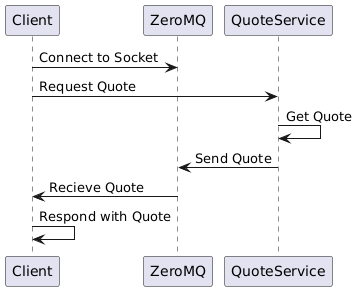

# Quote Microservice
This microservice will pull a random book quote from a CSV file and return the quote and author.

## Communication Contract
Requesting Data:
* To request data from the Quote Microservice, you will need to send a request to the ZeroMQ socket connected to the address `tcp://localhost:5555`

### Example Quote Request
```json
{
  "request": "Get Quote"
}

```
Receiving Data:
* The microservice will responsd with a random quote from the CSV file. 

### Example Quote Request
```json
{
  "quote": "Imperfection is beauty, madness is genius and it's better to be absolutely ridiculous than absolutely boring.",
  "author": "Marilyn Monroe"
}

```

#### Example call
```python
import zmq

def fetch():
    context = zmq.Context()
    socket = context.socket(zmq.REQ)
    socket.connect("tcp://localhost:5555")

    socket.send_string("Get Quote")
    response = socket.recv_string()

    return response
def quote_1():
    quote = fetch()
    print(quote)

if __name__ == "__main__":
    quote_1()


```
##### UML Diagram


